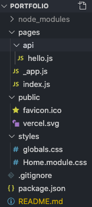
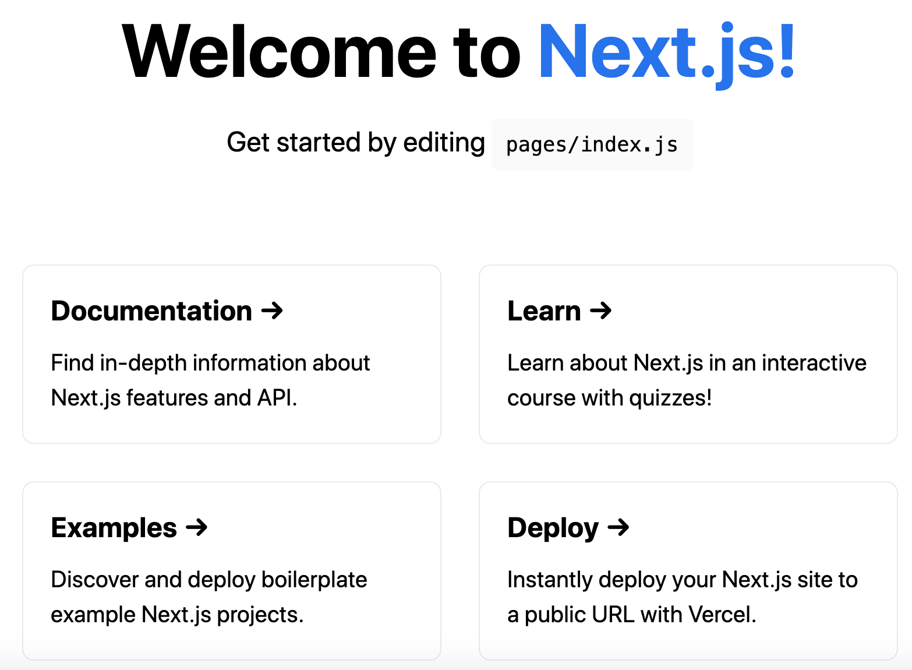

#### Initial Setup

1) Install base project.
    ~~~ bash
    npx create-next-app
    # or
    yarn create next-app
    ~~~

   - Note: if `yarn` is installed, `create-next-app` will use `yarn` to create the base project even though `npx` is used
   - If you want to use `npm` instead run with the "use npm" flag `create-react-app [project_name] --use-npm`

        ~~~ bash
        npx create-next-app portfolio
        ~~~

    - note the base project directory structure:

        

2) To run the development server, use either:

    - the base project will launch to `http://localhost:3000`
    - this can be changed using `npx next dev -p 4000`

        ~~~ bash
        npm run dev
        # or
        yarn dev
        ~~~

         

#### Project Setup

1) Create `BaseLayout.js` to a new folder `component/Layout/BaseLayout`

    ~~~ js
    import Header from '../shared/Header'

    const BaseLayout = (props) => {
            
    return (
            

                <Header />
                {props.children}
            

        )
    }

    export default BaseLayout
    ~~~

2) Create `class components` for about, portfolio, blogs, & cv pages. Simply return page text describing route wrapped in the `BaseLayout` component similar as with the `about.js` page.

    ~~~ js
    import React, {Component} from 'react'
    import BaseLayout from '../component/Layout/BaseLayout'

    class About extends Component {

        render() {
            return (
                <BaseLayout>
                    
 The About page

                </BaseLayout>
            )   
        }
    }

    export default About
    ~~~

3) Add file Header.js to new folder components/shared
    - the `Link` component facilitates changing routes on the `client-side` (e.g. switching between pages)

    ~~~ js
    import React from 'react'
    import Link from 'next/link'

    class Header extends React.Component {

        render() {
            return (
                

                    <Link href = "/" >
                        <a> Home </a>
                    </Link>
                    <Link href = "/portfolio" >
                        <a> Portfolio </a>
                    </Link>
                    <Link href = "/about" >
                        <a> About </a>
                    </Link>
                    <Link href = "/cv" >
                        <a> CV </a>
                    </Link>
                

                
            )
        }

    }

    export default Header
    ~~~
#### Styling options

1) Add basic styling after installing `sass` from the terminal `yarn    
    - add sass` and create   `main.scss` inside the `styles` folder
    - global styling must be added from `_app.js`
    - `styled jsx` is added to `Header.js`
    ~~~ js
    // _app.js
    // import '../styles/globals.css'
    import '../styles/main.scss'  // for a global CSS file

    // other page components are passed into MyApp
    // styles
    function MyApp({ Component, pageProps }) {
        return <Component {...pageProps} myAppProps = "Passed in from MyApp in _App"/>
    }

    export default MyApp
    ~~~

    ~~~ scss
    .customClassFromSCSS {
        color: dodgerblue;
    }
    ~~~

    ~~~ js
    // portfolio.js
    import React, {Component} from 'react'
    import BaseLayout from '../component/Layout/BaseLayout'

    class Portfolio extends Component {

        render() {

            const {myAppProps} = this.props

            return (
                <BaseLayout>
                    
 Portfolio Page with global style passed in

                    
{myAppProps}

                </BaseLayout>
            )
        }

    }

    export default Portfolio
    ~~~

    ~~~ js
    // Header.js
    ...
    <Link href = "/cv" >
        <a> CV </a>
    </Link>
     
    ~~~